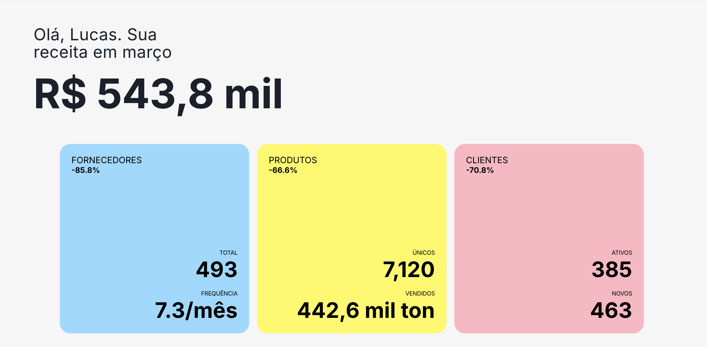
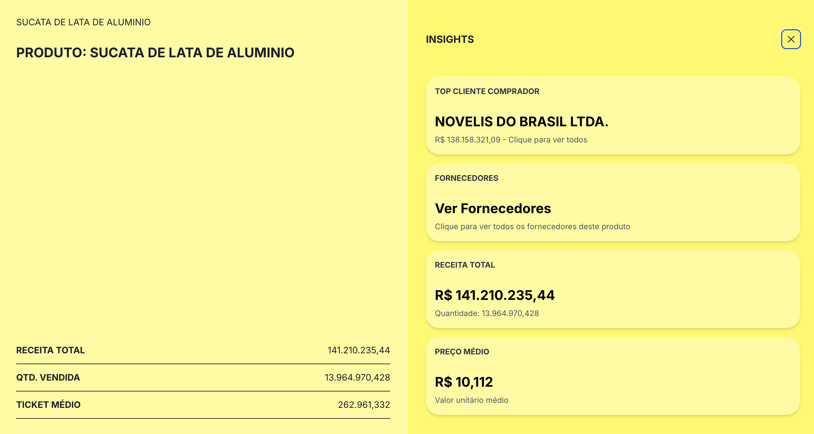
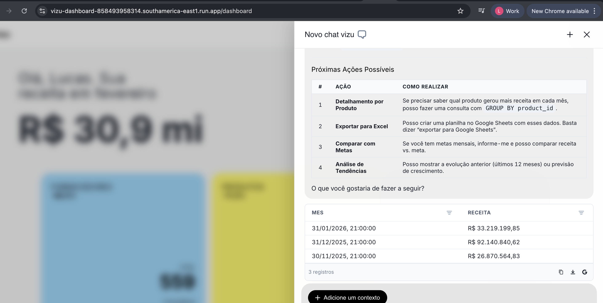
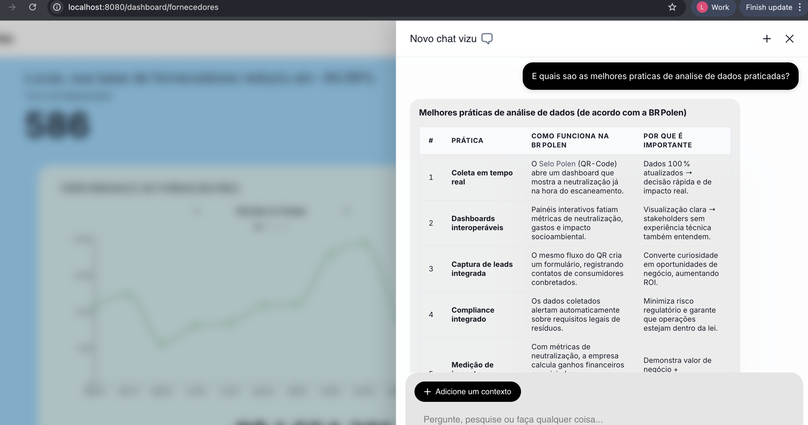
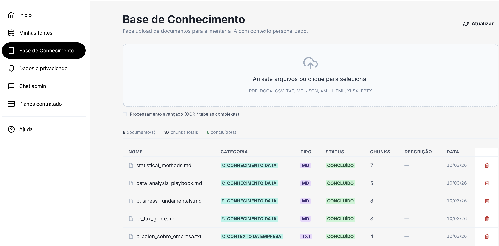
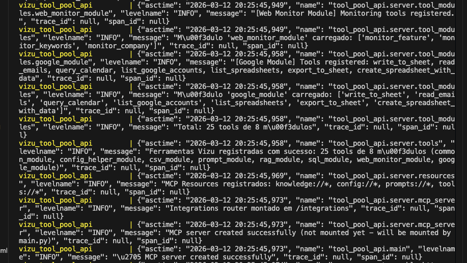
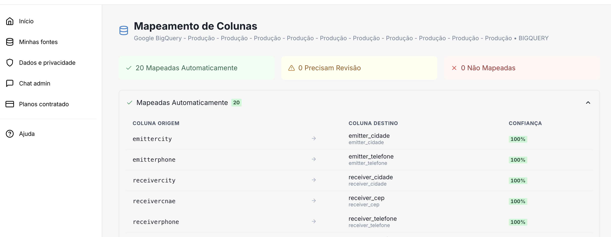

<div align="center">

# Vizu — AI-Powered Data Platform

**A production-grade, multi-tenant platform that centralizes business data and enables AI agents to analyze, query, and act on it.**

Built from scratch as a solo full-stack engineer — 20+ shared libraries, 6 microservices, 62 database migrations, ~60k lines of Python, ~21k lines of TypeScript.

[](#)
[](#)
[](#)
[](#)
[](#)
[](#)
[](#)

</div>

---

## The Problem

Small and medium businesses generate data across multiple platforms (ERPs, e-commerce, spreadsheets) but lack the tools to centralize, analyze, and act on it. Hiring data teams is expensive. Generic BI tools require technical expertise.

## The Solution

Vizu is a **data-centralization and analysis platform** that creates a context layer so **AI agents can perform tasks effectively** — from answering natural-language questions about sales data, to generating reports, to managing knowledge bases — all scoped per tenant with strict data isolation.

<div align="center">



*Dashboard — real-time KPI scorecards, charts, and AI chat in a unified interface*

</div>

---

## Platform Features

### 📊 Data Analysis & Visualization

Ingest data from multiple sources (BigQuery, Shopify, VTEX, CSV/XLSX uploads), transform it into a star-schema analytics layer, and visualize it through interactive dashboards with scorecards, bar charts, and detail views.

<div align="center">



*Detail view — drill-down into individual product analytics with AI-generated insights*

</div>

### 🗣️ Natural Language to SQL

Users ask questions in plain language; the platform converts them to safe, validated SQL queries. A defense-in-depth pipeline ensures security:

1. **Parse** — AST validation via `sqlglot` (only `SELECT` allowed)
2. **Validate** — table/column allowlists, mandatory filters, PII masking
3. **Rewrite** — expand `SELECT *`, inject `LIMIT`, enforce `client_id` filter
4. **Execute** — via PostgREST with RLS enforcement

<div align="center">



*Text-to-SQL — natural language query converted to validated SQL with results rendered in the chat*

</div>

### 📚 Knowledge Base (Hybrid RAG)

Upload documents (PDF, DOCX, TXT, CSV) to build per-tenant knowledge bases. The retrieval pipeline combines multiple strategies for high-quality answers:

- **Semantic search** — pgvector cosine similarity with multilingual embeddings
- **Keyword search** — PostgreSQL full-text search (BM25)
- **Reciprocal Rank Fusion** — merges semantic + keyword results
- **Reranking** — Cohere, CrossEncoder, or LLM-based reranking
- **MMR diversification** — Maximal Marginal Relevance to avoid redundant results

<div align="center">



*RAG pipeline — hybrid retrieval with source attribution and confidence scores*

</div>

<div align="center">



*Knowledge base management — upload, chunk, embed, and search documents per tenant*

</div>

### 🔧 MCP Tool Server (20+ Tools)

A centralized **FastMCP** server exposes tools that agents can invoke at runtime. Tools are registered as modular packages, each with its own auth, validation, and tier gating:

| Module | Tools | Description |
|--------|-------|-------------|
| `rag_module` | `executar_rag_cliente` | Hybrid semantic + BM25 document search |
| `sql_module` | `executar_sql_agent` | Safe text-to-SQL with defense-in-depth |
| `csv_module` | CSV analysis | Statistics, distributions, column profiling |
| `google_module` | Sheets, Gmail, Calendar | Full Google Workspace integration via OAuth |
| `common_module` | File retrieval, context | Utility tools for agent context |
| `web_monitor_module` | URL monitoring | Track website changes |
| `prompt_module` | MCP prompts | Langfuse-versioned prompt resources |
| `structured_data_formatter` | Output formatting | Deterministic formatting for reports |
| `config_helper_module` | Tool validation | Availability checks per tier |

<div align="center">



*MCP tool server — modular tool registration with health introspection*

</div>

### 🤖 Multi-Agent Architecture

The platform runs **specialized agents** built with LangGraph, orchestrated through a supervisor pattern:

- **Orchestrator (Atendente Core)** — LangGraph state machine with 4 nodes: `init` → `supervisor` → `execute_tools` → `elicit`. Routes between tool execution, knowledge retrieval, data analysis, and clarification requests.
- **Standalone Agents** — Catalog-driven factory that dynamically builds agents from database definitions. Each agent gets its own session, tools, and context.
- **Sales Agent / Support Agent** — Specialized lightweight agents using the shared `AgentBuilder` fluent API.

```
User message → Supervisor Node → Route decision
                    ├── execute_tools → MCP Server → Tool result → Response
                    ├── elicit → Clarification question → User
                    └── respond → Direct LLM response
```

### 🔐 Multi-Tenant Security & Context Isolation

Every layer enforces tenant isolation:

- **PostgreSQL Row-Level Security (RLS)** on all tables — 62 migrations maintain the schema
- **JWT validation** supporting HS256 + ES256 + RS256 (Supabase Auth)
- **Per-request context injection** — `VizuClientContext` carries tenant config, enabled tools, tier, and brand voice
- **Tool-level auth** — each MCP tool extracts and validates JWT independently
- **Tier-based access control** — tools, agents, and features gated by subscription tier (BASIC → PRO → ENTERPRISE → ADMIN)

### 📈 Observability & Prompt Management

- **OpenTelemetry** traces exported to Grafana Cloud (Tempo, Loki, Mimir)
- **Langfuse** as prompt management system — version-controlled prompts with A/B testing labels, Redis-cached with builtin fallbacks
- **One-line bootstrap** — `setup_observability(app, service_name)` instruments any service
- **End-to-end tracing** — from HTTP request → agent graph → tool call → LLM invocation → database query

### 🔄 Data Connectors & Ingestion

A factory-based connector system integrates with external data sources:

- **BigQuery** — federated queries via Foreign Data Wrappers
- **Shopify / VTEX / Loja Integrada** — e-commerce platform connectors
- **CSV/XLSX uploads** — automatic parsing, column detection, and schema inference
- **Column mapping** — AI-assisted mapping of source columns to the star-schema

<div align="center">



*Column mapping — AI-assisted mapping of imported data to the analytics schema*

</div>

### 💬 Human-in-the-Loop (HITL)

An elicitation service handles cases where the agent needs clarification or human approval:

- Multiple elicitation types: `yes_no`, `multiple_choice`, `free_text`
- Priority queue for human review (Streamlit UI)
- Audit trail for all decisions
- Integrated into the agent graph as a first-class node

---

## Architecture Overview

```
┌─────────────────────────────────────────────────────────────────────┐
│                        FRONTEND LAYER                               │
│  React 18 + TypeScript + Vite + Chakra UI                          │
│  ┌──────────────┐  ┌───────────────┐  ┌──────────────────┐        │
│  │  Dashboard    │  │  Chat Panel   │  │  HITL Review     │        │
│  │  (Scorecards, │  │  (SSE Stream) │  │  (Streamlit)     │        │
│  │   Charts)     │  │               │  │                  │        │
│  └──────┬───────┘  └──────┬────────┘  └────────┬─────────┘        │
└─────────┼─────────────────┼─────────────────────┼──────────────────┘
          │                 │                     │
          ▼                 ▼                     ▼
┌─────────────────────────────────────────────────────────────────────┐
│                      SERVICE LAYER (FastAPI)                        │
│  ┌──────────────┐  ┌───────────────┐  ┌──────────────────┐        │
│  │  Atendente   │  │  Standalone   │  │   File Upload    │        │
│  │  Core        │  │  Agent API    │  │   API            │        │
│  │  (LangGraph) │  │  (Catalog)    │  │   (Ingestion)    │        │
│  └──────┬───────┘  └──────┬────────┘  └────────┬─────────┘        │
│         │                 │                     │                   │
│         ▼                 ▼                     │                   │
│  ┌──────────────────────────────┐               │                  │
│  │   Tool Pool API (FastMCP)   │◄──────────────┘                  │
│  │   20+ tools, JWT per-tool   │                                   │
│  └──────────────┬──────────────┘                                   │
└─────────────────┼──────────────────────────────────────────────────┘
                  │
                  ▼
┌─────────────────────────────────────────────────────────────────────┐
│                       LIBRARY LAYER (20 packages)                   │
│  ┌──────────────┐ ┌──────────┐ ┌────────────┐ ┌────────────────┐  │
│  │ Agent        │ │ RAG      │ │ SQL        │ │ LLM Service    │  │
│  │ Framework    │ │ Factory  │ │ Factory    │ │ (multi-provider)│  │
│  ├──────────────┤ ├──────────┤ ├────────────┤ ├────────────────┤  │
│  │ Auth (JWT)   │ │ Context  │ │ Prompt     │ │ Observability  │  │
│  │              │ │ Service  │ │ Management │ │ Bootstrap      │  │
│  ├──────────────┤ ├──────────┤ ├────────────┤ ├────────────────┤  │
│  │ MCP Commons  │ │ Parsers  │ │ Tool       │ │ Data           │  │
│  │              │ │          │ │ Registry   │ │ Connectors     │  │
│  └──────────────┘ └──────────┘ └────────────┘ └────────────────┘  │
└─────────────────────────────────────────────────────────────────────┘
                  │
                  ▼
┌─────────────────────────────────────────────────────────────────────┐
│                       DATA LAYER                                    │
│  ┌──────────────────┐ ┌──────────┐ ┌───────────┐ ┌─────────────┐  │
│  │ PostgreSQL       │ │ pgvector │ │ Redis     │ │ Supabase    │  │
│  │ (RLS, analytics  │ │ (RAG     │ │ (cache,   │ │ (Auth, Edge │  │
│  │  star-schema)    │ │  chunks) │ │  checkpts)│ │  Functions) │  │
│  └──────────────────┘ └──────────┘ └───────────┘ └─────────────┘  │
└─────────────────────────────────────────────────────────────────────┘
```

---

## Shared Library Ecosystem (20 packages)

One of the core engineering decisions: **every reusable capability is a library, not duplicated code.** All services depend on the same shared packages:

| Library | Purpose |
|---------|---------|
| `vizu_agent_framework` | LangGraph builder pattern, state machines, node registry |
| `vizu_auth` | JWT decode (HS256/ES256/RS256), RLS context injection |
| `vizu_context_service` | Per-tenant context loading with Redis cache (5min TTL) |
| `vizu_data_connectors` | Factory for BigQuery, Shopify, VTEX, Loja Integrada |
| `vizu_db_connector` | SQLAlchemy async engine management |
| `vizu_elicitation_service` | Agent clarification requests (yes/no, multiple choice, free text) |
| `vizu_experiment_service` | Experiment manifests, batch evaluation, classification |
| `vizu_google_suite_client` | Google Sheets, Gmail, Calendar with OAuth token management |
| `vizu_hitl_service` | Human-in-the-loop review queue with Streamlit UI |
| `vizu_llm_service` | Provider abstraction (OpenAI, Anthropic, Google, Ollama) with tier budgets |
| `vizu_mcp_commons` | MCP tool dataclasses, executor with parallel invocation |
| `vizu_models` | Shared Pydantic/SQLModel domain models |
| `vizu_observability_bootstrap` | One-line OpenTelemetry + Langfuse + Grafana setup |
| `vizu_parsers` | PDF, DOCX, CSV, TXT parsing + semantic chunking |
| `vizu_prompt_management` | Langfuse prompt fetching with Redis cache and builtin fallbacks |
| `vizu_rag_factory` | Hybrid retrieval (semantic + BM25 + RRF + reranking + MMR) |
| `vizu_shared_utils` | Common utilities across all services |
| `vizu_sql_factory` | Text-to-SQL with AST validation, allowlists, PII masking |
| `vizu_supabase_client` | Typed Supabase SDK wrapper |
| `vizu_tool_registry` | Tool discovery, tier validation, Docker MCP bridge |
| `vizu_twilio_client` | WhatsApp webhook integration |

---

## Engineering Practices

| Practice | Implementation |
|----------|---------------|
| **Monorepo structure** | Single repo with `libs/`, `services/`, `apps/`, `supabase/` — shared dependencies via path imports |
| **Factory patterns** | `ConnectorFactory`, `StandaloneAgentFactory`, `RAGFactory` — pluggable components |
| **Builder pattern** | `AgentBuilder` fluent API: `.with_llm().with_mcp().with_checkpointer().build()` |
| **Dependency injection** | FastAPI `Depends()` for auth, context, and services |
| **Defense-in-depth** | SQL validation has 4 security layers; tools validate JWT independently |
| **12-factor config** | All config via environment variables, `.env` files, no hardcoded secrets |
| **Database migrations** | 62 Alembic/Supabase migrations — versioned schema evolution |
| **Code quality** | `ruff` for formatting + linting, enforced via `make fmt` / `make lint` |
| **Testing** | Unit tests, E2E smoke tests, persona tests, batch evaluation with Langfuse traces |
| **Streaming** | Server-Sent Events (SSE) for real-time agent responses |
| **Caching** | Redis for context (5min TTL), prompts, agent checkpoints, tool results |
| **Observability** | OpenTelemetry → Grafana Cloud; Langfuse for LLM traces; structured logging |

---

## Tech Stack

**Backend:** Python 3.11+, FastAPI, Pydantic, SQLModel, LangGraph, LangChain, FastMCP

**Frontend:** React 18, TypeScript, Vite, Chakra UI, Recharts

**AI/ML:** LangGraph agents, pgvector embeddings, hybrid RAG (BM25 + semantic + RRF), Cohere reranking, multi-provider LLM (OpenAI, Anthropic, Google, Ollama)

**Database:** PostgreSQL with RLS, pgvector, Supabase (Auth, Edge Functions, Storage, PostgREST)

**Infrastructure:** Docker Compose (dev), Google Cloud Run (prod), Artifact Registry, Redis, Nginx

**Observability:** OpenTelemetry, Grafana Cloud (Tempo, Loki, Mimir, Faro), Langfuse

**Auth:** Supabase Auth, JWT (HS256/ES256/RS256), PostgreSQL RLS, per-tool tier gating

---

## Repository Structure

```
apps/
├── vizu_dashboard/          # React 18 + TypeScript admin dashboard
├── hitl_dashboard/          # Streamlit HITL review interface
└── landing/                 # Marketing landing page

services/
├── atendente_core/          # Main LangGraph agent orchestrator
├── tool_pool_api/           # FastMCP server (20+ tools)
├── standalone_agent_api/    # Catalog-driven agent builder
├── file_upload_api/         # Document ingestion + vector pipeline
├── vendas_agent/            # Sales-specialized agent
└── support_agent/           # Support-specialized agent

libs/                        # 20 shared Python packages (see table above)

supabase/
├── migrations/              # 62 SQL migrations (RLS, star-schema, vector DB)
└── functions/               # 5 Edge Functions (search, process, sync, enrich, match)

scripts/                     # Evaluation, seeding, and utility scripts
docs/                        # Architecture documentation
```

---

## Quick Start

```bash
# 1. Clone and configure
git clone https://github.com/vizubr/vizu-mono.git
cd vizu-mono
cp .env.example .env          # fill in your keys

# 2. Start the development stack
make dev

# 3. Open the dashboard
open http://localhost:8080
```

Services run with **hot reload** and connect to a remote Supabase instance — no local database setup required.

### Available Commands

```bash
# Development
make dev               # Start core stack (dashboard + backend + tools + redis)
make dev-logs          # Tail all service logs
make dev-rebuild       # Rebuild after dependency changes

# Testing & Evaluation
make test              # Unit tests
make smoke-test        # End-to-end integration
make batch-run         # Batch test with Langfuse traces
make experiment-run    # Run evaluation experiments

# Database
make migrate           # Apply Alembic migrations
make migrate-prod      # Apply to production (with confirmation)

# Code Quality
make fmt               # Format with ruff
make lint              # Lint with ruff
make lint-fix          # Auto-fix lint issues

# Deployment
make cloudrun-build    # Build Docker images
make cloudrun-push-all # Push to GCP Artifact Registry
```

---

## About

This platform was designed and implemented by me as the **sole engineer** at Vizu, a startup delivering business management and productivity solutions for SMBs.

The goal: enable non-technical business users to ask questions, get reports, and manage their data through natural conversation — with AI doing the heavy lifting, securely scoped to each tenant's data.

**Key numbers:**
- ~60,000 lines of Python across 20 libraries and 6 services
- ~21,000 lines of TypeScript in the React dashboard
- 62 database migrations maintaining the schema
- 20+ MCP tools in a centralized tool server
- 5 Supabase Edge Functions
- Full observability pipeline (traces, metrics, logs, LLM monitoring)

---

*Designed and built by Lucas Cruz*
